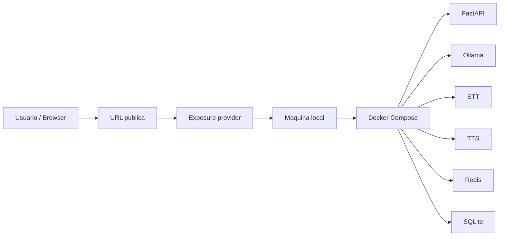

# Deployment y exposicion publica

El runtime pesado de este proyecto esta disenado para correr localmente:

```text
FastAPI + Ollama + STT + TTS + Redis + SQLite
```

La estrategia de despliegue para presupuesto cero es exponer ese runtime local
mediante un tunnel, no mover la inferencia a la nube.

## Exposure providers

```text
cloudflare_quick_tunnel
  funcional ahora, sin dominio, URL temporal

cloudflare_named_tunnel
  Terraform preparado para dominio propio en Cloudflare

gcp_local_relay_reference
  estructura conceptual sin recursos reales para evitar costos
```

## Opcion funcional sin dominio

Usar:

```text
infra/cloudflare/quick-tunnel
```

Comandos:

```powershell
docker compose up -d --build
docker compose -f infra/cloudflare/quick-tunnel/docker-compose.quick-tunnel.yml up
```

Copiar la URL `https://*.trycloudflare.com` que imprime `cloudflared` y abrirla
en el navegador.

## Opcion futura con dominio + Terraform

Usar:

```text
infra/terraform/cloudflare-named-tunnel
```

Esta opcion crea un tunnel nombrado y DNS record en Cloudflare. Requiere dominio
propio administrado por Cloudflare.

## Referencia GCP sin costos

Usar:

```text
infra/terraform/gcp-local-relay-reference
```

Esta carpeta no crea recursos. Sirve para explicar como se modelaria un provider
equivalente en GCP sin aplicar nada que pueda facturar.

## Diagrama



## Cost safety

- No ejecutar Terraform de GCP para crear recursos mientras el presupuesto sea
  cero.
- No compartir una URL publica indefinidamente.
- Detener `cloudflared` al terminar la demo.
- Mantener la inferencia local hasta tener presupuesto y monitoreo de costos.
