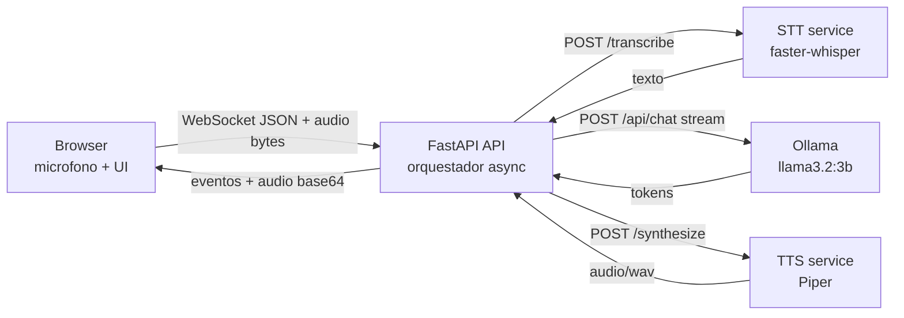
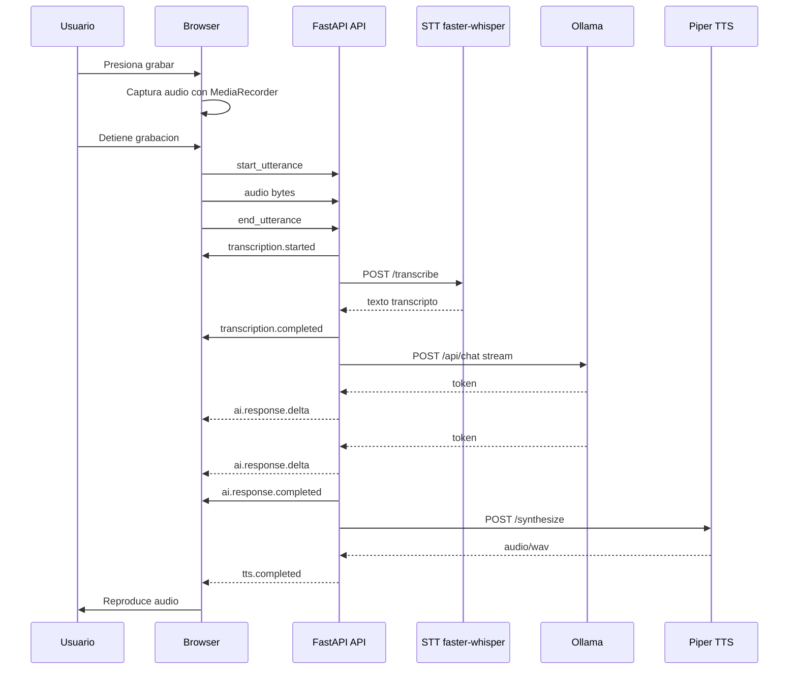
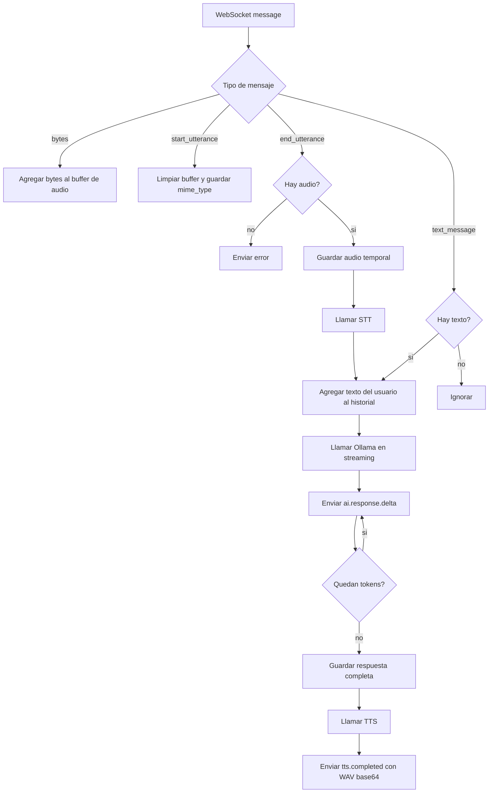
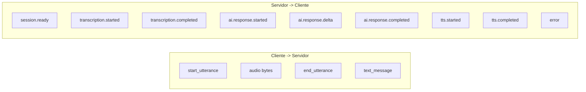

# Diagramas

## Arquitectura de servicios

```mermaid
flowchart LR
    Browser["Browser<br/>microfono + UI"] -->|WebSocket JSON + audio bytes| API["FastAPI API<br/>orquestador async"]
    API -->|POST /transcribe| STT["STT service<br/>faster-whisper"]
    API -->|POST /api/chat stream| Ollama["Ollama<br/>llama3.2:3b"]
    API -->|POST /synthesize| TTS["TTS service<br/>Piper"]
    TTS -->|audio/wav| API
    Ollama -->|tokens| API
    STT -->|texto| API
    API -->|eventos + audio base64| Browser
```

## Secuencia end-to-end de voz

```mermaid
sequenceDiagram
    participant U as Usuario
    participant B as Browser
    participant A as FastAPI API
    participant S as STT faster-whisper
    participant O as Ollama
    participant T as Piper TTS

    U->>B: Presiona grabar
    B->>B: Captura audio con MediaRecorder
    U->>B: Detiene grabacion
    B->>A: start_utterance
    B->>A: audio bytes
    B->>A: end_utterance
    A->>B: transcription.started
    A->>S: POST /transcribe
    S-->>A: texto transcripto
    A->>B: transcription.completed
    A->>O: POST /api/chat stream
    O-->>A: token
    A-->>B: ai.response.delta
    O-->>A: token
    A-->>B: ai.response.delta
    A->>B: ai.response.completed
    A->>T: POST /synthesize
    T-->>A: audio/wav
    A-->>B: tts.completed
    B->>U: Reproduce audio
```

## Flujo de decision en la API

```mermaid
flowchart TD
    Start["WebSocket message"] --> Type{"Tipo de mensaje"}
    Type -->|bytes| Append["Agregar bytes al buffer de audio"]
    Type -->|start_utterance| Reset["Limpiar buffer y guardar mime_type"]
    Type -->|end_utterance| HasAudio{"Hay audio?"}
    Type -->|text_message| HasText{"Hay texto?"}

    HasAudio -->|no| AudioError["Enviar error"]
    HasAudio -->|si| Temp["Guardar audio temporal"]
    Temp --> Transcribe["Llamar STT"]
    Transcribe --> UserText["Agregar texto del usuario al historial"]

    HasText -->|no| Ignore["Ignorar"]
    HasText -->|si| UserText

    UserText --> LLM["Llamar Ollama en streaming"]
    LLM --> Delta["Enviar ai.response.delta"]
    Delta --> More{"Quedan tokens?"}
    More -->|si| Delta
    More -->|no| Store["Guardar respuesta completa"]
    Store --> TTS["Llamar TTS"]
    TTS --> Audio["Enviar tts.completed con WAV base64"]
```

## Eventos WebSocket

```mermaid
flowchart LR
    subgraph Client["Cliente -> Servidor"]
        C1["start_utterance"]
        C2["audio bytes"]
        C3["end_utterance"]
        C4["text_message"]
    end

    subgraph Server["Servidor -> Cliente"]
        S1["session.ready"]
        S2["transcription.started"]
        S3["transcription.completed"]
        S4["ai.response.started"]
        S5["ai.response.delta"]
        S6["ai.response.completed"]
        S7["tts.started"]
        S8["tts.completed"]
        S9["error"]
    end
```

