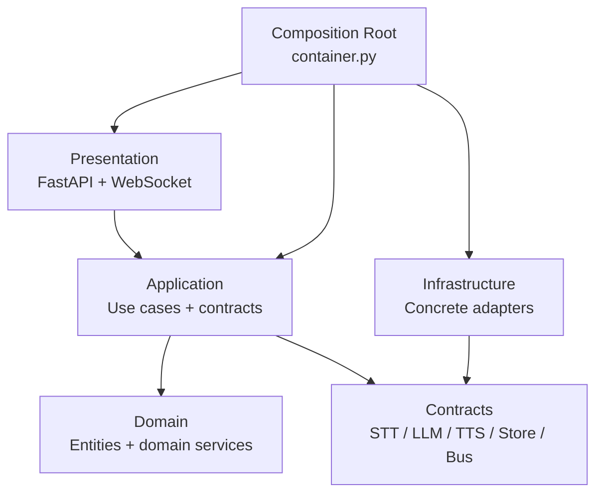
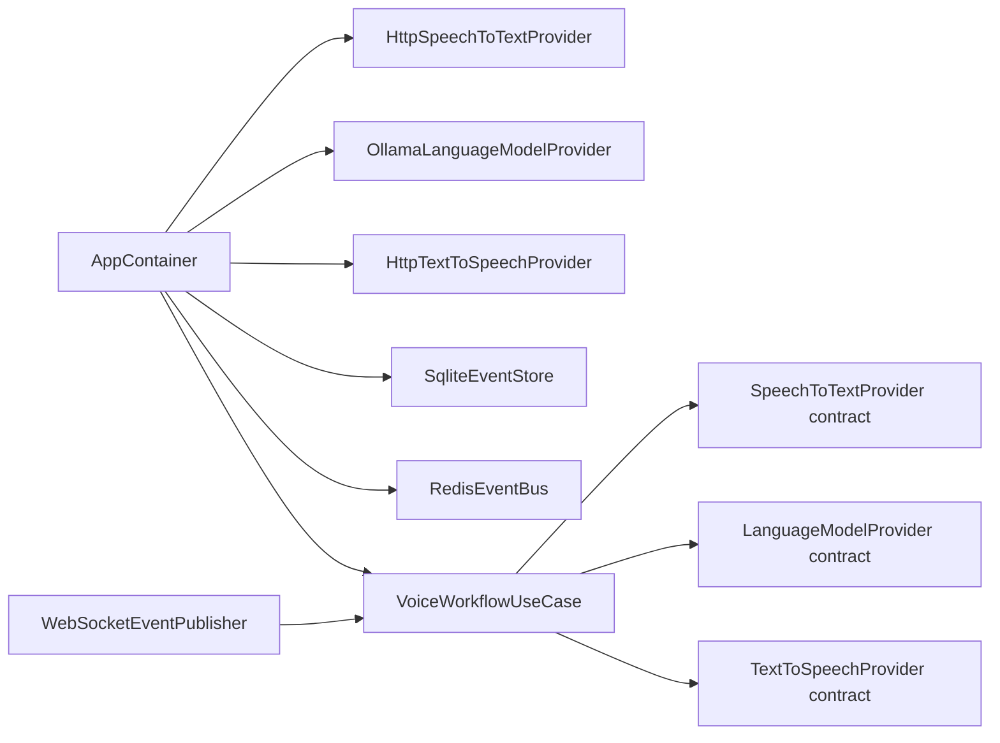
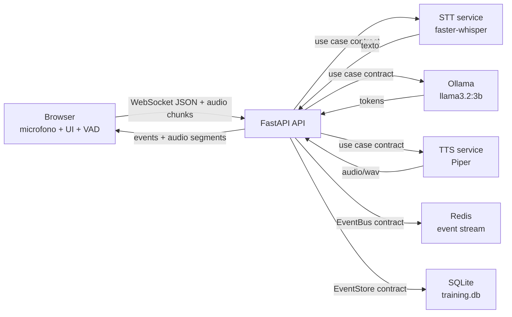
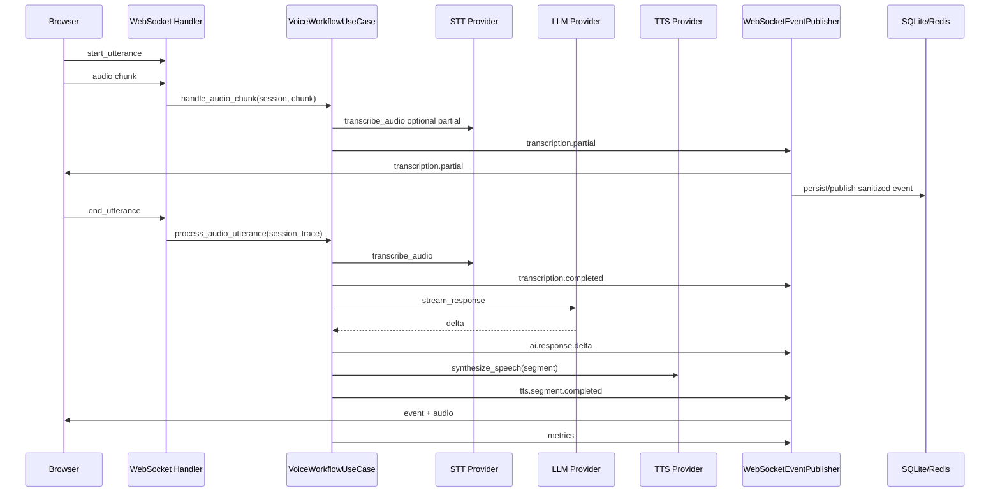
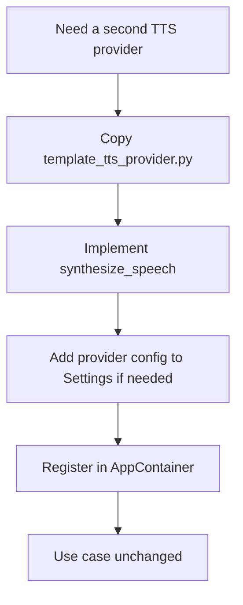
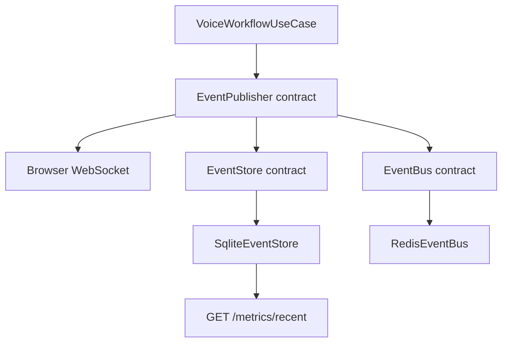
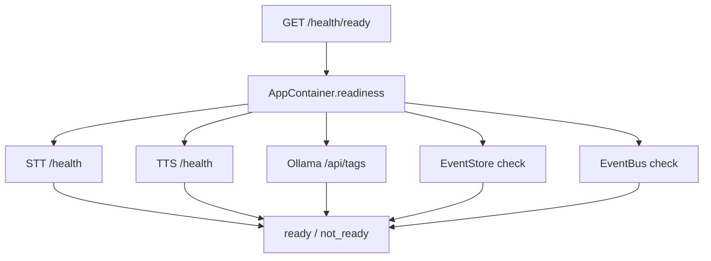
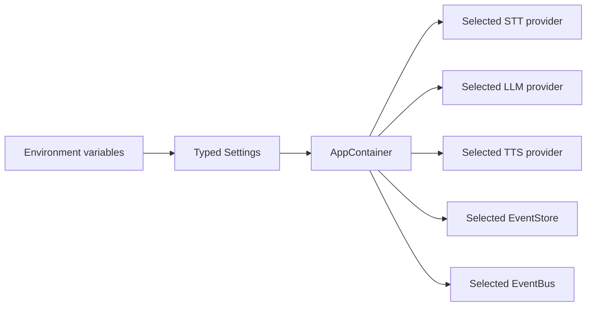
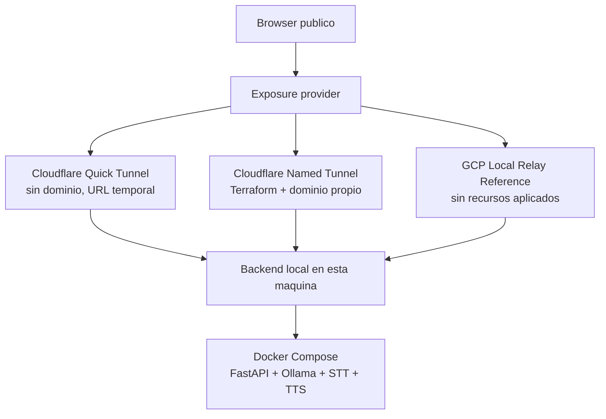
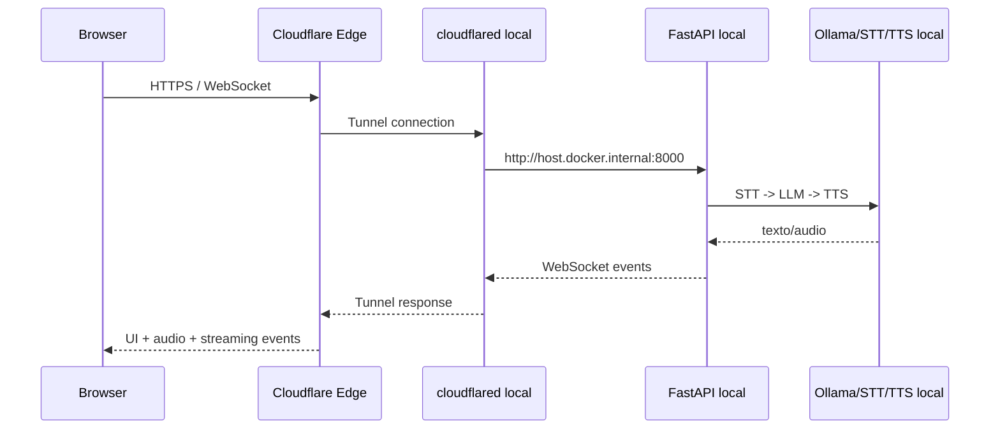

# Diagramas

## Capas

## Dependency Injection

## Arquitectura de servicios runtime

## Secuencia end-to-end de voz

## Provider replacement path

## Observabilidad y persistencia

## Health readiness

## Provider selection

## Exposure providers

## Cloudflare Quick Tunnel runtime

